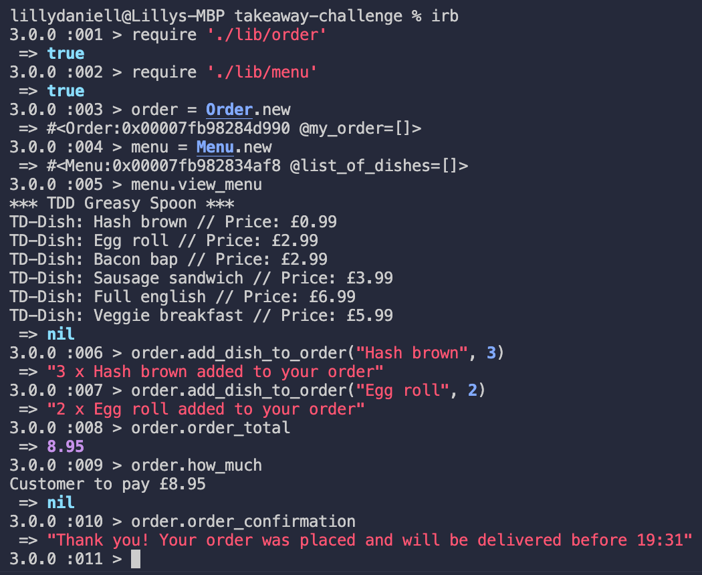
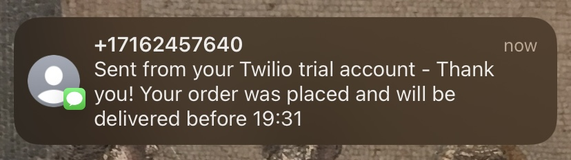

Takeaway Challenge
==================
```
                            _________
              r==           |       |
           _  //            |  M.A. |   ))))
          |_)//(''''':      |       |
            //  \_____:_____.-------D     )))))
           //   | ===  |   /        \
       .:'//.   \ \=|   \ /  .:'':./    )))))
      :' // ':   \ \ ''..'--:'-.. ':
      '. '' .'    \:.....:--'.-'' .'
       ':..:'                ':..:'

 ```

#### A command line application for a restaurant to create dishes and build a menu, and a customer to order a takeaway and receive a confirmation text with the expected time of arrival.

#### Integrated with Twilio API to send confirmation texts. Credentials and phone numbers are stored in environment variables for security.


User Stories
-----

```
As a customer
So that I can check if I want to order something
I would like to see a list of dishes with prices

As a customer
So that I can order the meal I want
I would like to be able to select some number of several available dishes

As a customer
So that I can verify that my order is correct
I would like to check that the total I have been given matches the sum of the various dishes in my order

As a customer
So that I am reassured that my order will be delivered on time
I would like to receive a text such as "Thank you! Your order was placed and will be delivered before 18:52" after I have ordered
```

Summary
-----

**The Restaurant**
* Dish
  * A dish is created with a name and a price
  * Prices are input as a float with two decimal points
  * Dishes can be itemised as a hash (#itemise method)

* Menu
  * Dishes can be added to the menu (#add_to_menu(dish) method)
  * Menu can be viewed (#view_menu method)
  * DEFAULT_MENU constant supplied, access with access_menu method
  * Added a banner for the takeaway cafe: "*** TDD Greasy Spoon ***"

**The Customer**
* Order
  * An order is initialized with an empty my_order array 
  * Dishes can be added one by one to the order, receives name and quantity as arguments (#add_dish_to_order(name, quantity))
  * #view_order method for customer which includes cost of item 
  * #how_much method to output total order cost
  

Getting Started
-----

Clone this repository
```
$ git clone https://github.com/lildann/takeaway-challenge
$ cd takeaway-challenge
```

Install Bundler
```
$ gem install bundler
```

Install all program dependencies
```
$ bundle install
```

If you want to receive a text confirming your order [sign up for a free Twilio trial account](https://www.twilio.com/docs/usage/tutorials/how-to-use-your-free-trial-account) and set environment variables
```
$ touch .env
```

Add your Twilio credentials and the number you want the text sent to the .env file 
```
TWILIO_ACCOUNT_SID='ACXXXXXXXXXXXX'
TWILIO_AUTH_TOKEN='your_auth_token'
TWILIO_NUM='your_twilio_number'
PHONE_NUM='number_to_receive_text'
```

Usage of Takeaway App
-----


Twilio Text Confirmation
-----

